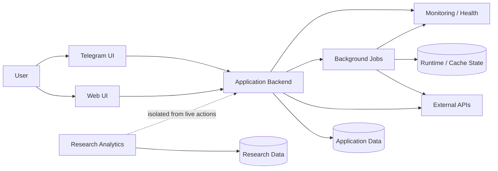
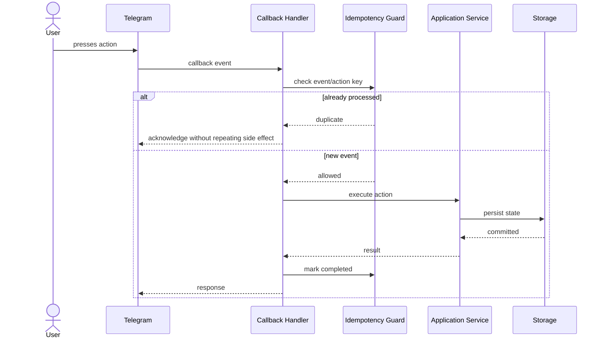
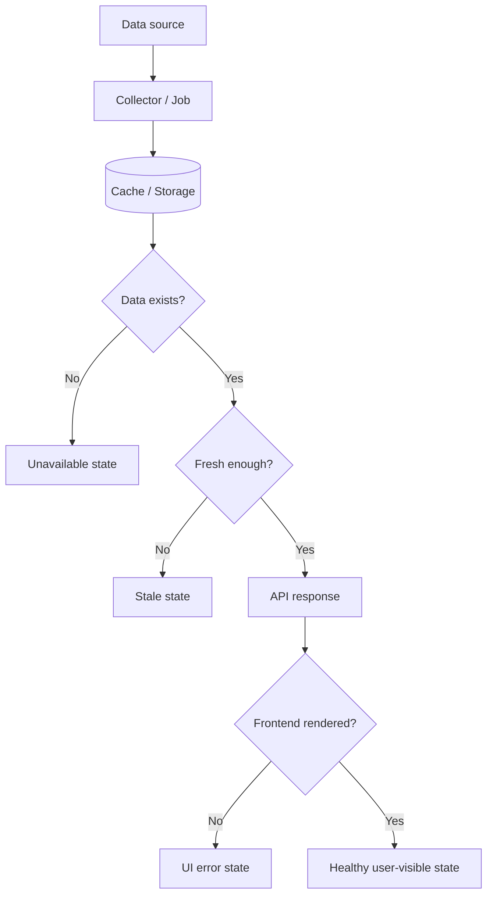
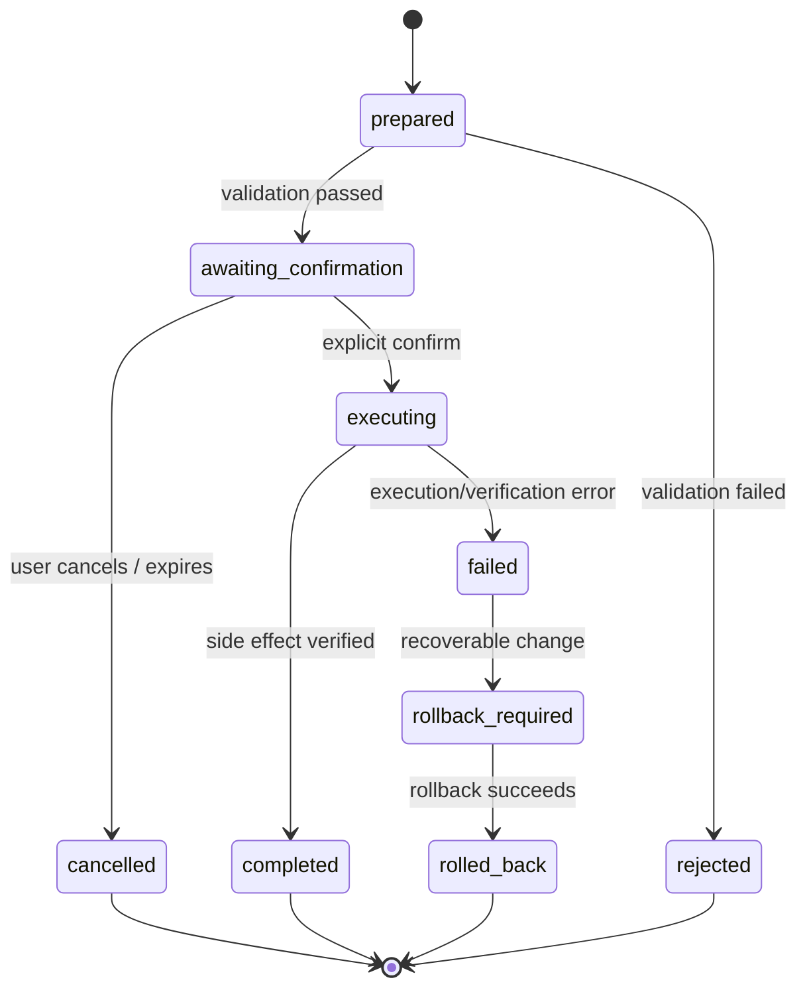
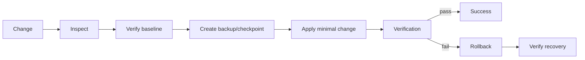
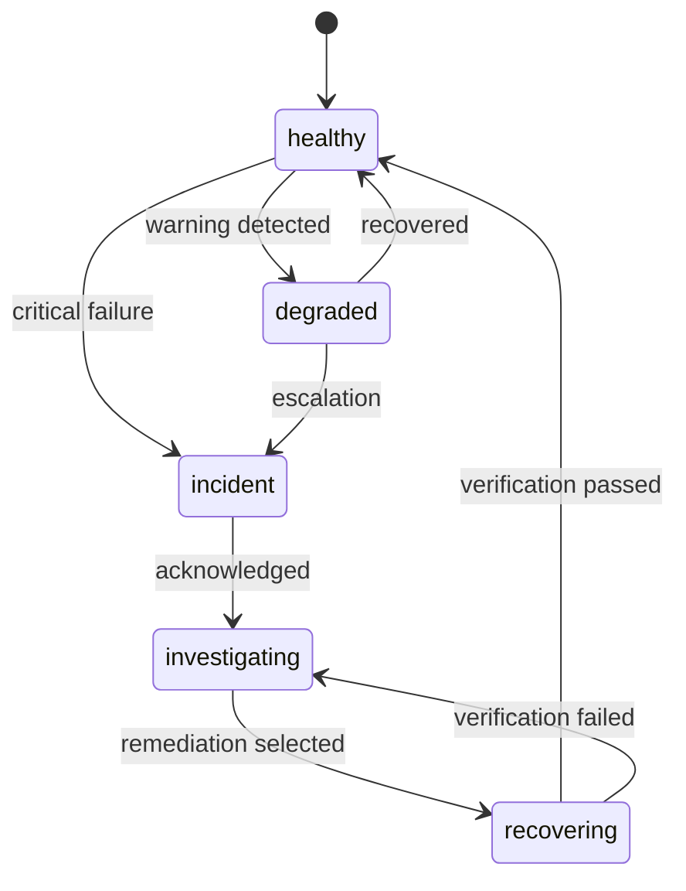
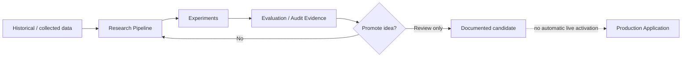

# BullSignal diagrams

Public-safe diagrams for discussing system boundaries, reliability and integration design. Real production topology, credentials, provider details, private endpoints and trading rules are intentionally excluded.

## 1. High-level architecture

The portfolio describes responsibilities and boundaries, not real host placement.

## 2. Telegram callback with duplicate protection

## 3. Data freshness contract

A successful HTTP response alone is not considered proof that the user sees fresh data.

## 4. Confirmation-gated action

## 5. Deployment safety flow

## 6. Monitoring / incident lifecycle

## 7. Research isolation

## Interview talking points

- Why idempotency is an integration requirement, not a Telegram-specific hack.
- Why freshness and availability are different states.
- Why rollback belongs in deployment design before an incident happens.
- Where user-facing interfaces end and application services begin.
- Why research code is isolated from live side effects.
- How monitoring states help distinguish warning, incident, recovery and verification.
