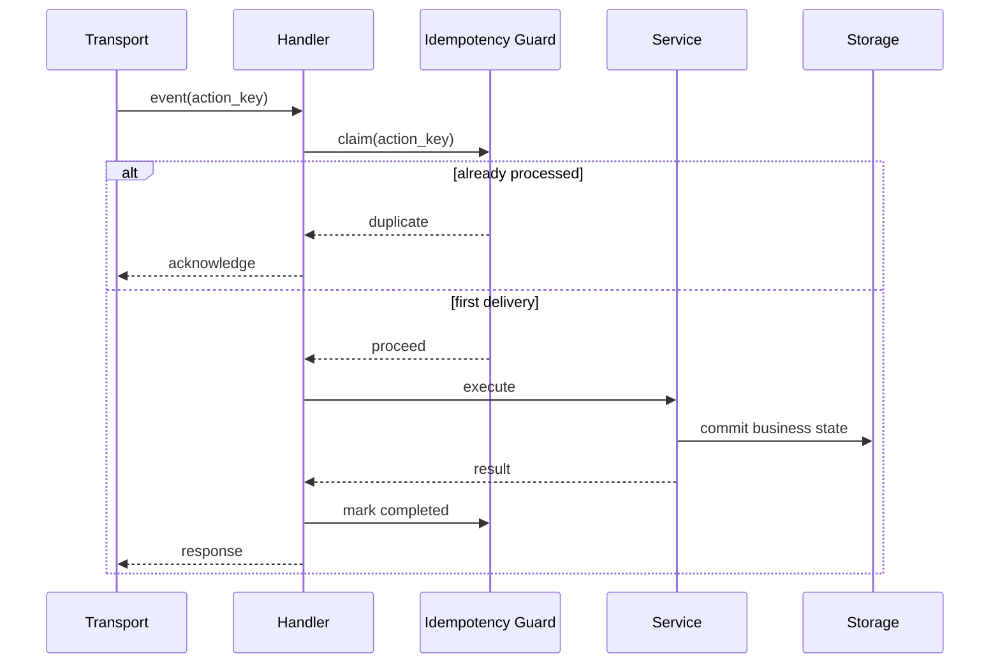
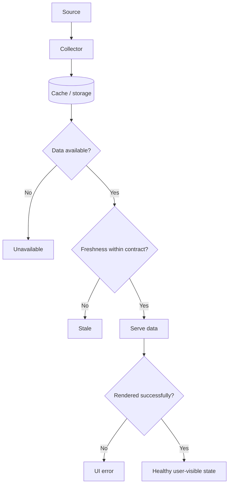
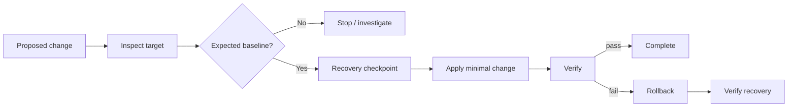

# BullSignal — reliability cases

Public-safe reliability notes derived from engineering problems encountered while evolving BullSignal. Details that would reveal production topology, credentials, trading logic or private operational data are intentionally omitted.

## Case 1 — duplicate callback / duplicate side effect

### Symptom

One user action could be handled more than once, causing duplicate output or risking repeated side effects.

### Bad fix

Add a special-case flag around one handler and assume the transport will never retry elsewhere.

### Better requirement

> One logical user action must produce at most one business side effect even when the same delivery is received or retried multiple times.

### Design response

### Analyst questions

- What is the idempotency key: transport event ID, business operation ID or both?
- How long is it retained?
- What happens if the DB commit succeeds but acknowledgement times out?
- Is replaying a read operation different from replaying a mutation?

### Verification

- duplicate delivery after success does not repeat the business mutation;
- timeout/retry path returns a stable result;
- unrelated operations are not deduplicated accidentally.

---

## Case 2 — data exists but is stale

### Symptom

The API/UI may technically respond while the underlying market/runtime data is old enough to be misleading.

### Bad requirement

> Endpoint should return HTTP 200.

Availability alone says nothing about freshness.

### Better contract

### States worth separating

- source reachable / unreachable;
- data absent / available;
- available but stale / fresh;
- API healthy / unhealthy;
- frontend rendered / failed.

### Analyst questions

- Which timestamp is authoritative for freshness?
- Is freshness threshold the same for every data type?
- Should stale data be hidden, labelled or returned with metadata?
- What should monitoring alert on: collector failure, age threshold, API failure or all three?

### Verification

A freshness test must manipulate/observe data age, not only HTTP status.

---

## Case 3 — repository state is not necessarily deployed state

### Symptom

A source repository or old archive may not exactly match what is currently deployed after a sequence of patches, rollbacks or operational changes.

### Risk

A valid change prepared against the wrong baseline can corrupt or overwrite a newer production state.

### Safer workflow

### Requirement

> A deployment must validate the relevant target baseline immediately before mutation; historical repository assumptions are not sufficient evidence.

### Analyst questions

- What identifies the baseline: file hashes, version markers, schema version, health state?
- Which mismatches are safe to migrate and which must fail closed?
- What evidence proves rollback actually restored a healthy state?

---

## Why these cases matter

They all point to the same system-analysis lesson: **integration reliability lives in contracts between states and components**.

The useful questions are not only "does the function work?", but also:

- what happens on duplicate delivery?;
- what happens when data is present but wrong-age?;
- what happens when current state differs from the state assumed by the change?;
- what evidence proves success or recovery?

Related material: [BullSignal case study](BULLSIGNAL_CASE_STUDY.md) · [diagrams](BULLSIGNAL_DIAGRAMS.md)
