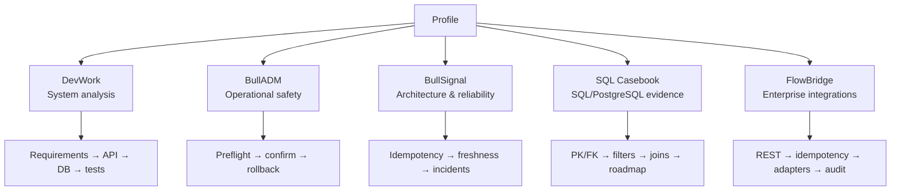

# Portfolio map

This page is the fastest way to review the portfolio depending on what you want to evaluate.

## 5-minute technical review

1. **DevWork** — start with the [README](https://github.com/blsoo/devwork-system-analysis), then follow one requirement through use case, API, SQL and tests.
2. **BullADM** — open the [repository](https://github.com/blsoo/bulladm-ops-automation), review the operation state machine, then risk/threat material.
3. **BullSignal** — open the [system architecture repository](https://github.com/blsoo/bullsignal-system-architecture), then reliability/freshness/deployment cases.
4. **SQL Casebook** — open the [repository](https://github.com/blsoo/sql-postgresql-casebook) for directly reviewable relational queries and learning progression.
5. **FlowBridge** — open the [repository](https://github.com/blsoo/flowbridge-integration-platform) for an enterprise-integration design from requirement to API/error/idempotency/test contracts.

## Evidence by skill

| Skill | Evidence |
|---|---|
| Requirements analysis | DevWork, BullADM, BullSignal and FlowBridge requirements |
| Business rules | DevWork/BullADM explicit rule sets; FlowBridge process/idempotency invariants |
| SQL / relational model | SQL Casebook + DevWork ERD/PostgreSQL schema/examples |
| REST / HTTP | DevWork API/OpenAPI; FlowBridge REST/OpenAPI/error contract; BullSignal integration contracts |
| Integration analysis | FlowBridge scenarios; DevWork integrations; BullSignal duplicate/freshness cases |
| Sequence modelling | DevWork, BullADM, BullSignal and FlowBridge sequence diagrams |
| State modelling | task/action lifecycles, operation states, incidents and FlowBridge request delivery states |
| Failure analysis | stale state, duplicates, timeout ambiguity, verification failure and rollback |
| Risk / threat analysis | BullADM risk register and public-safe threat model |
| Traceability | requirement → workflow/interface → verification matrices across the cases |
| CI/CD thinking | public GitHub Actions validators + deployment workflow modelling |
| Reliability | idempotency, fail-closed behaviour, availability/freshness separation, retry semantics |
| Change impact | DevWork recurring-task change request and issue-backed implementation plan |
| Engineering process | open roadmap issues with acceptance criteria instead of manufactured historical tickets |

## Portfolio structure

## Flagship projects

### DevWork

**Focus:** system analysis, requirements, domain/data modelling, REST/OpenAPI, SQL, integration behaviour, tests and traceability.

- [Repository](https://github.com/blsoo/devwork-system-analysis)
- [Roadmap](https://github.com/blsoo/devwork-system-analysis/blob/main/ROADMAP.md)
- [Open issues](https://github.com/blsoo/devwork-system-analysis/issues)

### BullADM

**Focus:** operational automation, safety gates, state machines, rollback, trust boundaries, risk/threat analysis and failure handling.

- [Repository](https://github.com/blsoo/bulladm-ops-automation)
- [Roadmap](https://github.com/blsoo/bulladm-ops-automation/blob/main/ROADMAP.md)
- [Open issues](https://github.com/blsoo/bulladm-ops-automation/issues)

### BullSignal

**Focus:** larger integration/reliability project: web/backend flows, Telegram, external APIs, background jobs, monitoring, freshness, deployment safety and research isolation.

Production implementation stays private; public material is deliberately sanitized.

- [Repository](https://github.com/blsoo/bullsignal-system-architecture)
- [Reliability cases](https://github.com/blsoo/bullsignal-system-architecture/blob/main/RELIABILITY_CASES.md)
- [Architecture diagrams](https://github.com/blsoo/bullsignal-system-architecture/blob/main/DIAGRAMS.md)
- [Roadmap](https://github.com/blsoo/bullsignal-system-architecture/blob/main/ROADMAP.md)

## Targeted technical cases

### SQL & PostgreSQL Casebook

**Focus:** directly reviewable SQL knowledge with an explicit learning boundary: relational identity/relationships, filtering, NULL, ordering, counts and JOIN behaviour are demonstrated; more advanced SQL is roadmap work until mastered.

- [Repository](https://github.com/blsoo/sql-postgresql-casebook)
- [Challenges](https://github.com/blsoo/sql-postgresql-casebook/blob/main/CHALLENGES.md)
- [Learning log](https://github.com/blsoo/sql-postgresql-casebook/blob/main/LEARNING_LOG.md)
- [Open issues](https://github.com/blsoo/sql-postgresql-casebook/issues)

### FlowBridge

**Focus:** enterprise integration analysis: REST/HTTP contract, validation, PostgreSQL model, idempotency, retry/timeout behaviour, adapter boundaries and audit evidence.

The current repo is explicitly an analysis/design baseline; persistence, HTTP implementation and real adapter prototypes are tracked as next work.

- [Repository](https://github.com/blsoo/flowbridge-integration-platform)
- [OpenAPI](https://github.com/blsoo/flowbridge-integration-platform/blob/main/openapi.yaml)
- [Integration scenarios](https://github.com/blsoo/flowbridge-integration-platform/blob/main/INTEGRATION_SCENARIOS.md)
- [Open issues](https://github.com/blsoo/flowbridge-integration-platform/issues)
