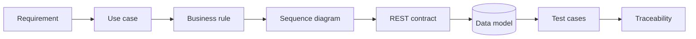

# Portfolio map

This page is the fastest way to review the portfolio depending on what you want to evaluate.

## 5-minute technical review

1. **DevWork** — start with the [README](https://github.com/blsoo/devwork-system-analysis) and follow one requirement through use case, API, SQL and tests.
2. **BullADM** — open the [operation workflow](https://github.com/blsoo/bulladm-ops-automation) and review confirmation, backup, verification and rollback.
3. **BullSignal** — read the [sanitized case study](BULLSIGNAL_CASE_STUDY.md) and [architecture diagrams](BULLSIGNAL_DIAGRAMS.md) for integration/reliability examples.

## Evidence by skill

| Skill | Evidence |
|---|---|
| Requirements analysis | DevWork `REQUIREMENTS.md`, use cases, acceptance criteria |
| Business rules | DevWork/BullADM explicit rule sets |
| SQL / relational model | DevWork ERD, PostgreSQL schema, SQL examples |
| REST / HTTP | DevWork API contract + OpenAPI 3.1 |
| Integration analysis | DevWork integration scenarios; BullSignal duplicate/freshness flows |
| UML-style sequence modelling | DevWork, BullADM and BullSignal Mermaid sequence diagrams |
| State modelling | task lifecycle, action proposals, operational deployment states |
| Failure analysis | stale proposals, duplicate requests, verification failure, rollback |
| Traceability | requirement → use case → interface → test matrices |
| CI/CD thinking | public GitHub Actions checks + BullADM deployment workflow model |
| Reliability | idempotency, fail-closed behaviour, health/freshness separation |
| Change impact | DevWork recurring-task change request and impact analysis |

## One requirement end-to-end

A reviewer can start from the requirement **"data-changing actions require explicit confirmation"** and trace it through:

That trace is intentional: the portfolio is designed to demonstrate analysis, not only implementation.

## Projects

### DevWork

**Focus:** system analysis, requirements, domain/data modelling, REST/OpenAPI, SQL, tests, traceability.

Repository: https://github.com/blsoo/devwork-system-analysis

### BullADM

**Focus:** operational automation, safety gates, state machines, rollback, trust boundaries, failure handling.

Repository: https://github.com/blsoo/bulladm-ops-automation

### BullSignal

**Focus:** larger integration/reliability project: web/backend flows, Telegram, external APIs, background jobs, monitoring and research isolation.

Production implementation stays private. Public material is deliberately sanitized:

- [Engineering case study](BULLSIGNAL_CASE_STUDY.md)
- [Architecture diagrams](BULLSIGNAL_DIAGRAMS.md)
