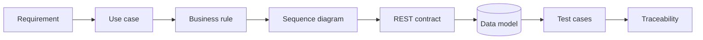

# Portfolio map

This page is the fastest way to review the portfolio depending on what you want to evaluate.

## 5-minute technical review

1. **DevWork** — start with the [README](https://github.com/blsoo/devwork-system-analysis), then open `INTERVIEW_GUIDE.md` and follow one requirement through use case, API, SQL and tests.
2. **BullADM** — open the [repository](https://github.com/blsoo/bulladm-ops-automation), review the operation state machine, then `RISK_REGISTER.md` / `THREAT_MODEL.md`.
3. **BullSignal** — read the [sanitized case study](BULLSIGNAL_CASE_STUDY.md), [architecture diagrams](BULLSIGNAL_DIAGRAMS.md) and [reliability mini-postmortems](BULLSIGNAL_RELIABILITY_CASES.md).

## Evidence by skill

| Skill | Evidence |
|---|---|
| Requirements analysis | DevWork requirements/use cases; BullADM requirements |
| Business rules | explicit DevWork/BullADM rule sets |
| SQL / relational model | DevWork ERD, PostgreSQL schema, SQL examples |
| REST / HTTP | DevWork API contract, OpenAPI 3.1, concrete HTTP/JSON examples |
| Integration analysis | DevWork integration scenarios; BullSignal duplicate/freshness cases |
| Sequence modelling | DevWork, BullADM and BullSignal sequence diagrams |
| State modelling | task lifecycle, action proposal and operational deployment state machines |
| Failure analysis | stale proposals, duplicate requests, verification failure, rollback |
| Risk / threat analysis | BullADM risk register and public-safe threat model |
| Traceability | requirement → use case/workflow → interface → test matrices |
| CI/CD thinking | three public GitHub Actions validation flows + deployment workflow modelling |
| Reliability | idempotency, fail-closed behaviour, availability/freshness separation |
| Change impact | DevWork recurring-task change request and issue-backed implementation plan |
| Engineering process | real open roadmap issues with acceptance criteria, not manufactured historical tickets |

## One requirement end-to-end

A reviewer can start from **"data-changing actions require explicit confirmation"** and trace it through:

That trace is intentional: the portfolio is designed to demonstrate analysis, not only implementation.

## Projects

### DevWork

**Focus:** system analysis, requirements, domain/data modelling, REST/OpenAPI, SQL, integration behaviour, tests and traceability.

- [Repository](https://github.com/blsoo/devwork-system-analysis)
- [Roadmap](https://github.com/blsoo/devwork-system-analysis/blob/main/ROADMAP.md)
- [Open issues](https://github.com/blsoo/devwork-system-analysis/issues)

### BullADM

**Focus:** operational automation, safety gates, state machines, rollback, trust boundaries, risk/threat analysis and failure handling.

- [Repository](https://github.com/blsoo/bulladm-ops-automation)
- [Roadmap](https://github.com/blsoo/bulladm-ops-automation/blob/main/ROADMAP.md)
- [Open issues](https://github.com/blsoo/bulladm-ops-automation/issues)

### BullSignal

**Focus:** larger integration/reliability project: web/backend flows, Telegram, external APIs, background jobs, monitoring and research isolation.

Production implementation stays private. Public material is deliberately sanitized:

- [Engineering case study](BULLSIGNAL_CASE_STUDY.md)
- [Architecture diagrams](BULLSIGNAL_DIAGRAMS.md)
- [Reliability mini-postmortems](BULLSIGNAL_RELIABILITY_CASES.md)
