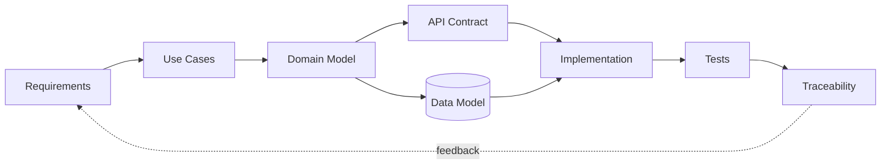

# Hi, I'm Leonid

**Junior System Analyst · Automation & Integration**

I build and document systems around APIs, data, backend logic and workflow automation.

## Core skills

`SQL` `REST API` `HTTP` `JSON` `PostgreSQL` `System Analysis` `Requirements` `Integrations` `Python` `PHP` `Git/GitHub` `Linux` `CI/CD` `Telegram Bot API` `1C`

## Flagship projects

### DevWork — system analysis & workflow automation

A portfolio project that shows the full analyst chain:

**Requirements → Use Cases → Domain Model → ERD → SQL → REST/OpenAPI → Tests → Traceability**

[Open DevWork →](https://github.com/blsoo/devwork-system-analysis)

### BullSignal

A larger private engineering project around web/backend flows, Telegram, external APIs, monitoring, reliability and deployment safety. Public-safe architecture material is being extracted separately so production details and private history stay private.

### BullADM

Operational automation built around controlled actions, explicit confirmation, preflight checks, backup, verification and rollback. A public-safe case study is being prepared as a separate repository.

## How I think about systems

## What you can review in my portfolio

- functional and non-functional requirements;
- acceptance criteria;
- use cases and alternative flows;
- architecture and system-context diagrams;
- ER models with PK/FK relationships;
- sequence diagrams;
- state machines;
- REST contracts and OpenAPI;
- SQL schema and example queries;
- system-level test cases;
- requirements traceability;
- engineering decisions and failure scenarios.

## Current direction

I study **Software Engineering at Vologda State University** and focus on system analysis, backend/integration development and enterprise automation.

I use AI tools as part of an engineering workflow for analysis, prototyping, review and debugging, while keeping requirements, architecture and system behaviour explainable.

Currently interested in **Junior System Analyst / System Analyst Intern / Integration & Automation** roles.
