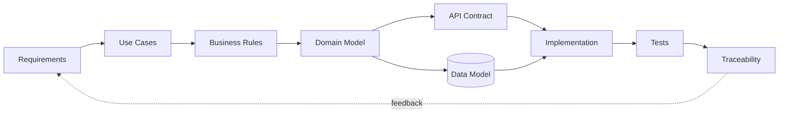

# Hi, I'm Leonid

**Junior System Analyst · Automation & Integration**

I build and document systems around APIs, data, backend logic and workflow automation.

## Core skills

`SQL` `REST API` `HTTP` `JSON` `PostgreSQL` `System Analysis` `Requirements` `Integrations` `Python` `PHP` `Git/GitHub` `Linux` `CI/CD` `Telegram Bot API` `1C`

## Flagship projects

### DevWork — system analysis & workflow automation

Full analyst chain from requirement to verification:

**Requirements → Use Cases → Business Rules → Domain Model → ERD → SQL → REST/OpenAPI → Tests → Traceability**

[Open DevWork →](https://github.com/blsoo/devwork-system-analysis)

### BullADM — operational automation

Mobile-first control-plane case focused on safe privileged workflows:

**Inspect → Preflight → Confirm → Backup → Apply → Verify → Rollback**

Includes requirements, business rules, state machines, sequence diagrams, operation contract, failure scenarios and traceability.

[Open BullADM →](https://github.com/blsoo/bulladm-ops-automation)

### BullSignal — larger private engineering project

Web/backend, Telegram and external-API project with reliability, monitoring and deployment-safety work. The production repository stays private; only sanitized architecture/case material is intended for the public portfolio.

## How I think about systems

## What you can review in my portfolio

- functional and non-functional requirements;
- acceptance criteria and business rules;
- use cases and alternative flows;
- architecture and system-context diagrams;
- ER models with PK/FK relationships;
- sequence diagrams and state machines;
- REST contracts and OpenAPI;
- SQL schema and example queries;
- system-level test cases;
- requirements traceability;
- operational failure/recovery scenarios and engineering decisions.

## Current direction

I study **Software Engineering at Vologda State University** and focus on system analysis, backend/integration development and enterprise automation.

Currently interested in **Junior System Analyst / System Analyst Intern / Integration & Automation** roles.
