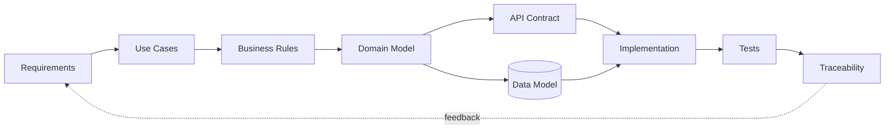

# Hi, I'm Leonid

**Junior System Analyst · Automation & Integration**

I design and document systems around APIs, data, backend logic, integrations and workflow automation.

## Core skills

`SQL` `REST API` `HTTP` `JSON` `PostgreSQL` `System Analysis` `Requirements` `Integrations` `Python` `PHP` `Git/GitHub` `Linux` `CI/CD` `Telegram Bot API` `1C`

> **Short on time?** Open the [5-minute portfolio map](PORTFOLIO_MAP.md).

## Flagship projects

### DevWork — system analysis & workflow automation

Full analyst trail from requirement to verification:

**Requirements → Use Cases → Business Rules → Domain Model → ERD → SQL → REST/OpenAPI → Tests → Traceability**

[Open DevWork →](https://github.com/blsoo/devwork-system-analysis)

### BullADM — operational automation

Mobile-first control-plane case focused on safe privileged workflows:

**Inspect → Preflight → Confirm → Backup → Apply → Verify → Rollback**

Requirements, state machines, sequence diagrams, operation contract, risk/threat analysis, failure scenarios and traceability.

[Open BullADM →](https://github.com/blsoo/bulladm-ops-automation)

### BullSignal — system architecture & reliability

Large integration case around web/backend flows, Telegram, external APIs, background jobs, monitoring, deployment safety and isolated analytics research.

**Idempotency → Freshness contracts → Incident modelling → Baseline verification → Recovery → Research isolation**

Production implementation stays private; the public repository contains sanitized architecture, requirements, integration contracts, reliability postmortems, traceability and CI safety checks.

[Open BullSignal architecture →](https://github.com/blsoo/bullsignal-system-architecture)

## Targeted technical cases

### JobRadar — vacancy intelligence & Telegram workflow

A useful end-to-end product that searches HeadHunter vacancies, normalizes and scores them with explainable rules, deduplicates delivery and sends actionable Telegram cards.

**HH API → normalization → scoring → SQLite state → Telegram → save / skip / prepare application → feedback events**

The MVP includes working Python code, tests and CI. External application submission is deliberately separated behind an OAuth/action boundary so the system never marks a vacancy as applied just because a request was attempted.

[Open JobRadar →](https://github.com/blsoo/jobradar-vacancy-intelligence)

### SQL & PostgreSQL Casebook

A growing relational-query portfolio where **completed means explainable**. Current evidence covers PK/FK, filtering, NULL, ordering, counts, INNER/LEFT JOIN and missing-related-row queries; advanced SQL stays in the roadmap until learned.

[Open SQL Casebook →](https://github.com/blsoo/sql-postgresql-casebook)

### FlowBridge — enterprise integration design

Analysis-first integration case:

**REST request → validation → idempotency → PostgreSQL → workflow → CRM/ERP adapter → retry/recovery → audit evidence**

Includes requirements, process/data models, OpenAPI 3.1, error/idempotency semantics, integration sequences, tests and traceability. Executable adapters/persistence are explicitly roadmap work rather than being presented as finished production code.

[Open FlowBridge →](https://github.com/blsoo/flowbridge-integration-platform)

## How I approach a system

## What you can review here

- functional/non-functional requirements and acceptance criteria;
- use cases, alternative flows and business rules;
- architecture, ERD, sequence and state diagrams;
- REST contracts and OpenAPI;
- SQL schema and practical queries;
- integration, retry, idempotency and stale-state scenarios;
- system-level test cases and traceability;
- operational risk, threat, failure and rollback modelling;
- change-impact analysis and engineering decisions;
- a working vacancy-monitoring product with external API + Telegram + persistent decision state;
- CI checks that protect the public portfolio boundary;
- explicit roadmaps that separate demonstrated work from the next learning/implementation stage.

## Current direction

I study **Software Engineering at Vologda State University** and focus on system analysis, backend/integration development and enterprise automation.

Currently interested in **Junior System Analyst / System Analyst Intern / Integration & Automation** roles.
