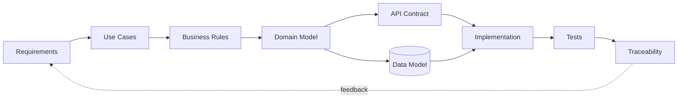

# Hi, I'm Leonid

**Junior System Analyst · Automation & Integration**

I design and document systems around APIs, data, backend logic, integrations and workflow automation.

## Core skills

`SQL` `REST API` `HTTP` `JSON` `PostgreSQL` `System Analysis` `Requirements` `Integrations` `Python` `PHP` `Git/GitHub` `Linux` `CI/CD` `Telegram Bot API` `1C`

> **Short on time?** Open the [5-minute portfolio map](PORTFOLIO_MAP.md).

## Flagship projects

### DevWork — system analysis & workflow automation

Full analyst trail from requirement to verification:

**Requirements → Use Cases → Business Rules → Domain Model → ERD → SQL → REST/OpenAPI → Tests → Traceability**

[Open DevWork →](https://github.com/blsoo/devwork-system-analysis)

### BullADM — operational automation

Mobile-first control-plane case focused on safe privileged workflows:

**Inspect → Preflight → Confirm → Backup → Apply → Verify → Rollback**

Requirements, state machines, sequence diagrams, operation contract, risk/threat analysis, failure scenarios and traceability.

[Open BullADM →](https://github.com/blsoo/bulladm-ops-automation)

### BullSignal — integration & reliability case

A larger private engineering project around web/backend flows, Telegram, external APIs, background jobs, monitoring, deployment safety and isolated analytics research.

Production code and infrastructure remain private; the public material is sanitized:

[Case study](BULLSIGNAL_CASE_STUDY.md) · [Architecture diagrams](BULLSIGNAL_DIAGRAMS.md) · [Reliability mini-postmortems](BULLSIGNAL_RELIABILITY_CASES.md)

## How I approach a system

## What you can review here

- functional/non-functional requirements and acceptance criteria;
- use cases, alternative flows and business rules;
- architecture, ERD, sequence and state diagrams;
- REST contracts and OpenAPI;
- SQL schema and practical queries;
- integration, retry, idempotency and stale-state scenarios;
- system-level test cases and traceability;
- operational risk, threat, failure and rollback modelling;
- change-impact analysis and engineering decisions;
- CI checks that protect the public portfolio boundary.

## Current direction

I study **Software Engineering at Vologda State University** and focus on system analysis, backend/integration development and enterprise automation.

Currently interested in **Junior System Analyst / System Analyst Intern / Integration & Automation** roles.
