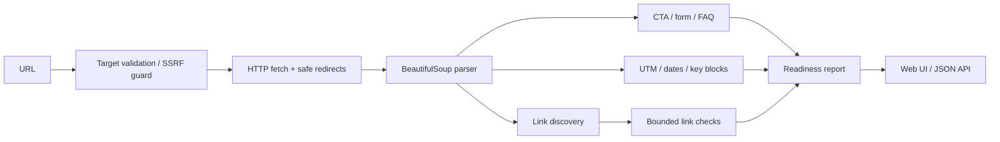

# Architecture

## Design decisions

- **Server-side checker**: required for link status checks and consistent parsing.
- **Bounded crawler**: only one landing page plus at most 30 discovered links; this is preflight QA, not a crawler.
- **Manual Telegram layer**: business logic that depends on an authenticated Telegram/NotiBot session is reported as manual QA instead of pretending it can be verified from HTML.
- **Evidence-first output**: every check returns a status, short explanation and evidence so a technical specialist can quickly decide whether the launch is blocked.
- **Fail-safe URL handling**: redirects are revalidated and private/reserved network ranges are rejected.
